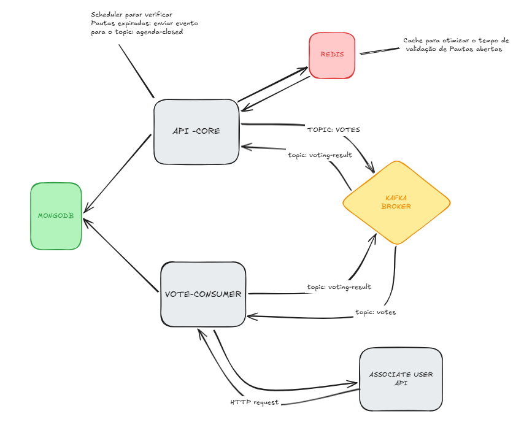

# Sicredi Challenge - Sistema de Votação



Este projeto é uma solução para o desafio técnico de backend, que consiste num sistema de gestão de pautas e sessões de votação para associados.

O sistema foi desenvolvido utilizando **Java** e é composto por uma arquitetura distribuída/microsserviços, dividida nos seguintes módulos principais:

- 📦 **core**: API principal responsável pela gestão de pautas, abertura de sessões e recebimento de votos.
- ⚙️ **user-api**: API responsável pela validação de utilizadores/associados (CPF).
- 📨 **vote-consumer**: Serviço de mensageria (consumidor) responsável por processar, validar e contabilizar os votos de forma assíncrona.

## 🛠️ Tecnologias Utilizadas

- **Java 21**
- **Spring Boot 3**
- **MongoDB** (Persistência de dados)
- **Redis** (Cache e controle de sessão)
- **Apache Kafka** (Mensageria assíncrona)
- **Docker** e **Docker Compose**
- **Feign Client** (Comunicação entre serviços)

## 🚀 Pré-requisitos

Antes de começar, precisará de ter as seguintes ferramentas instaladas no seu computador:

- [Git](https://git-scm.com/)
- [Docker](https://www.docker.com/get-started)
- [Docker Compose](https://docs.docker.com/compose/install/)

## ⚙️ Instruções de Inicialização

A aplicação foi contentorizada para facilitar a execução. Todo o ambiente (base de dados, mensageria e as aplicações) pode ser iniciado utilizando o Docker Compose.

1. **Clone o repositório:**
   ```bash
   git clone https://github.com/jp4bidube/sicred-challenge.git
   cd sicred-challenge
   ```

2. **Inicie os contentores da aplicação:**
   Na raiz do projeto (onde o ficheiro `docker-compose.yml` está localizado), execute o seguinte comando para construir e iniciar os serviços em segundo plano:
   ```bash
   docker compose up --build -d
   ```

3. **Verifique se os serviços estão a correr:**
   ```bash
   docker compose ps
   ```

4. **Acompanhe os registos/logs (opcional):**
   Para acompanhar a inicialização da API e do Consumer:
   ```bash
   docker compose logs -f
   ```

## 📚 Documentação da API

Após a inicialização completa, as APIs estarão disponíveis. Pode aceder à documentação interativa via Swagger através das seguintes ligações:

- **Core API (Pautas e Votos):** [http://localhost:8080/swagger-ui.html](http://localhost:8080/swagger-ui.html)
- **User API (Validação CPF):** [http://localhost:8082/swagger-ui.html](http://localhost:8082/swagger-ui.html)

## 🛑 Como parar a aplicação

Para parar a execução dos contentores e libertar os recursos da máquina, execute:

```bash
docker compose down
```

Se desejar remover também os volumes da base de dados (apagando definitivamente os dados guardados), execute:

```bash
docker compose down -v
```

## 🧪 Tarefas Bônus Implementadas

- **Tarefa Bônus 1 (Integração com sistemas externos):** A `user-api` valida se o CPF é válido e retorna se o associado está apto a votar (`ABLE_TO_VOTE`) ou não (`UNABLE_TO_VOTE`). O `vote-consumer` consulta essa API antes de computar o voto.
- **Tarefa Bônus 2 (Mensageria):** O sistema utiliza Kafka para processamento assíncrono de votos. A API `core` apenas recebe o voto e o envia para uma fila. O `vote-consumer` processa a fila, valida e salva no banco.
- **Tarefa Bônus 3 (Performance):** Utilização de Redis para validação rápida de status da sessão de votação e índices compostos no MongoDB para garantir unicidade do voto sem lock de tabela.
- **Tarefa Bônus 4 (Versionamento):** A API utiliza versionamento semântico e boas práticas de REST.

---
Desenvolvido por **João Pedro (jp4bidube)**
